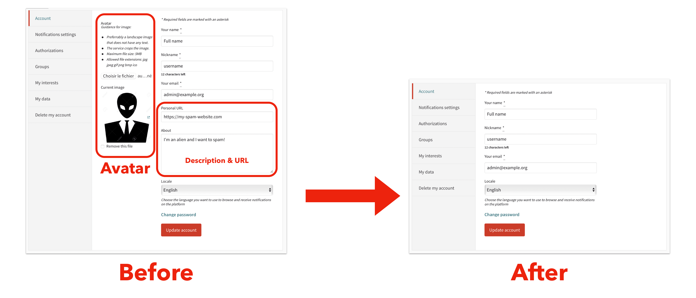
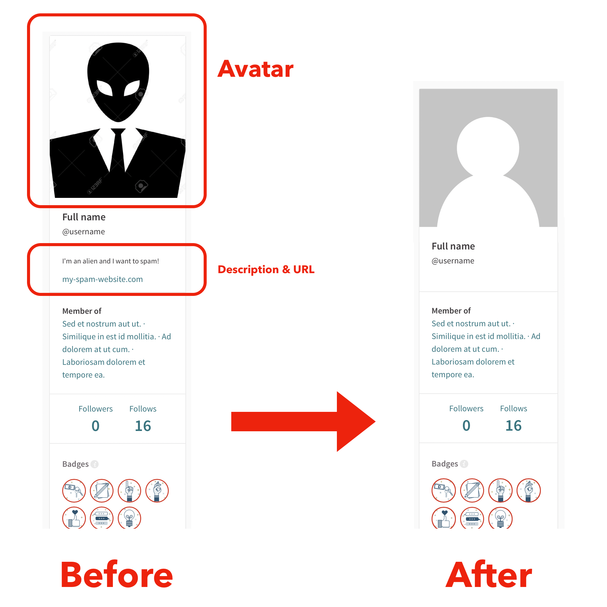

# Decidim::Faceless

This module was created as a result of our platforms becoming increasingly vulnerable to spam. Oftentimes, this spam materialises as users created solely to display advertisement on their profile info and to post spam as posts or comments.

It addresses the first issue by disabling the configuration options that users have to add a profile picture, a description, and link to an external website.



It also hides these elements on the user profile's page, and everywhere else the user's avatar can be displayed.



## Usage

There is no configuration for this module, you just need to install it (see below). To disable it, uninstall it.

## Installation

1. Add this line to your application's Gemfile:

```ruby
gem "decidim-faceless", git: "https://github.com/digidemlab/decidim-module-faceless"
```

And then execute:

```bash
bundle
```

## Contributing

Create an issue or a PR if you want to suggest an improvement. Keep in mind I'd like to keep this module lightweight and simple to maintain.

## License

This module is distributed under the GNU AFFERO GENERAL PUBLIC LICENSE.
